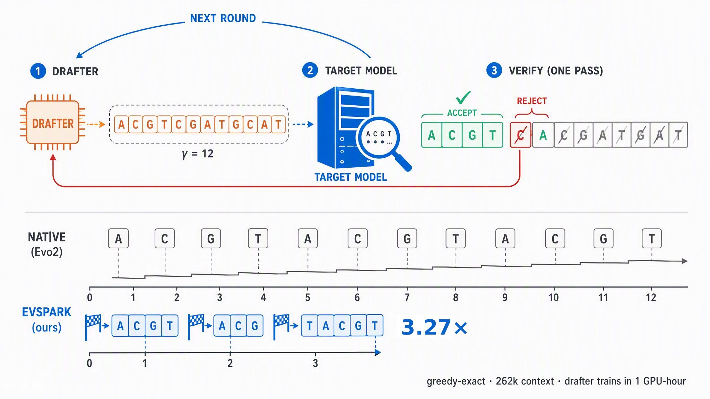
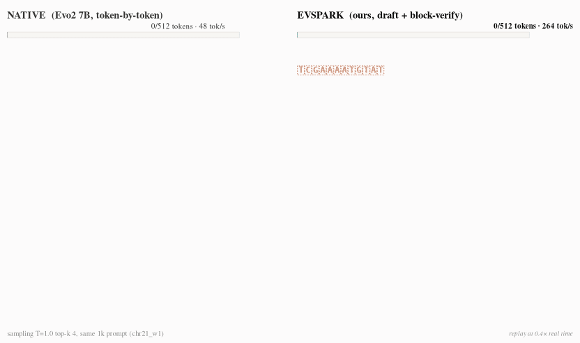

# EvSpark

**Lossless speculative decoding for Evo2 — StripedHyena2 hybrid DNA foundation models**

[**Paper (bioRxiv)**](https://www.biorxiv.org/content/10.64898/2026.09.02.749017v1)
· [DOI](https://doi.org/10.64898/2026.09.02.749017)
· [Hugging Face](https://huggingface.co/dinghhhhhhhhhhhhhhh/EvSpark)
· [ModelScope](https://www.modelscope.cn/models/dinghao1120/EvSpark)



EvSpark accelerates single-stream Evo2 7B generation by **2.8–3.3×** with a small
distilled drafter that proposes γ tokens per round, while staying **provably
lossless**: every block is verified against the target model's distribution
(rejection sampling), and greedy output is token-for-token identical to native
decoding.



*Same prompt, same weights — left: native Evo2 decoding, right: EvSpark speculative decoding. Both sides sample from the same distribution (T=1.0, top_k=4) but with different random seeds, so the emitted sequences legitimately differ — EvSpark's guarantee is distributional equivalence (and token-for-token identity in greedy mode), not identical samples.*

## Why this is non-trivial

Evo2 is a **StripedHyena2 hybrid** (hyena IIR filters + sparse attention), so classic
KV-cache rollback does not apply. EvSpark contributes:

- **State-slice rollback** over both Hyena IIR filter states and attention KV
  (`evspark/specdec/block/slice.py`) — no full replay, rollback cost <5% of a step.
- **A distilled γ-parallel drafter** conditioned on injected mid/late-layer hidden
  states, with a Markov-bias head and per-position confidence
  (`evspark/train/drafter.py`, `evspark/specdec/block/neural_draft.py`).
- **Exact verification**: block forward with initial-state injection
  (`evspark/specdec/block/driver.py`) + rejection-sampling verifier
  (`evspark/specdec/verifier.py`) — greedy-exact, sampling-distribution-exact.

## Results at a glance

Evo2 7B (bf16), single stream, RTX 4090. Suite = 48 genomic prompts (43 real +
5 random) × 1024 tokens, three training seeds. The packaged prompt pack
(`evspark/data/eval_prompts_24.json`) is a self-contained 24-prompt subset of
this v2 suite.

| Metric | Value |
|---|---|
| Suite mean speedup, flagship drafter (γ=12, 150M distill tokens), all-48 | **3.27×** |
| — flagship, real-sequence subset (43 prompts) | 2.96× |
| Suite mean, cost-optimal drafter (γ=12, 30M) | 3.15× / 2.82× (all-48 / real-43) |
| Suite mean, legacy γ=7 drafter (150M) | 2.81× / 2.60× (all-48 / real-43) |
| Long context: *E. coli* genome, 262k | 1.97× / 2.28× / 2.43× (3 seeds) |
| Long context: *B. subtilis*, 262k | 1.84× / 2.05× |
| Speedup vs context length | flat from 1k to 51k (GTDB 3-contig) |
| Greedy losslessness, 48 prompts × 6 checkpoints | **0 non-tie divergences** |
| Sampling equivalence | KL ≤ 1.6× of a native-vs-native floor on 10 prompts |
| Drafter training cost, γ=12@30M (→ 3.15×) | **~1.06 GPU-hour** on one 4090 |
| Baselines (same protocol): Markov-k5 / prompt-lookup k=2, k=3 | 2.65× / 1.24× / 1.30× |

Full protocol, per-region table, ablations (injection layer, drafter width, γ,
distill budget) and cost model are in the
[paper](https://www.biorxiv.org/content/10.64898/2026.09.02.749017v1).

## Install

Requirements: Linux, Python 3.11, one GPU with ~40 GB VRAM (RTX 4090/5090, A100,
H100). Note: Ada GPUs (4090) run Evo2 in **bf16** only — the FP8/Transformer-Engine
path requires Hopper.

```bash
git clone https://github.com/dhnihaoya/EvSpark && cd EvSpark
conda create -n evo2 python=3.11 -y && conda activate evo2
pip install torch==2.7.1            # cu126/cu128 wheels both work on Ada
pip install flash-attn==2.8.0.post2 # prebuilt wheels on PyPI for torch 2.7
pip install evo2                    # pulls vortex (vtx)
python -m evo2.test.test_evo2_generation --model_name evo2_7b   # smoke test
```

Everything runs from the repo root — no installation of EvSpark itself is
needed (the `evspark` package is importable from the repo root directly).
Optionally `pip install -e .` to import it from anywhere.

The first run downloads the Evo2 7B weights (~13 GB) from Hugging Face
automatically; set `HF_ENDPOINT=https://hf-mirror.com` if huggingface.co is
unreachable.

## Quickstart

```bash
# 1. get a drafter checkpoint (~160 MB; HF first, ModelScope fallback)
python scripts/download_ckpt.py L27_g12_150M_s1

# 2. run the demo: speculative vs native on a 1 kb lacZ prompt,
#    greedy mode asserts token-for-token equality
python scripts/demo.py --ckpt L27_g12_150M_s1 --greedy
#    sampling mode measures wall-clock speedup:
python scripts/demo.py --ckpt L27_g12_150M_s1 --n-tokens 1024

# 3. your own sequence
python scripts/demo.py --ckpt L27_g12_150M_s1 --prompt-file my_genome_window.fa
```

Expected output (single RTX 4090, greedy, 128 tokens):

```
[evspark] drafter=L27_g12_150M_s1.pt layers=['blocks.27'] gamma=12
[demo] prompt=1024 bp, generating 1024 tokens (sampling T=1.0 top_k=4)

  native      :   23.51 s  (  43.6 tok/s)
  speculative :    9.01 s  ( 113.6 tok/s)
  speedup     : 2.61x   (mean accepted tau=6.04, rounds=171)
```
Single-prompt demo on a human chr21 intergenic window. Speedup is
region-dependent: bacterial coding is the hardest region, while random regions
reach 5.95×; the v2 suite means are **3.27×** over all 48 prompts and 2.96×
over the 43 real-sequence prompts. Greedy mode on coding regions degenerates
into repeats (a known property of greedy DNA decoding) — use it for the
exact-match check, not as a speed showcase.

## Use it as a library

From the repo root (or anywhere after `pip install -e .`):

```python
from evspark import EvSpark

with EvSpark.load("L27_g12_150M_s1") as es:      # auto-downloads the drafter ckpt
    res = es.generate("ACGTACGT...", n_tokens=1024)   # sampling (T=1.0, top_k=4)
    print(res.text, f"{res.tok_s:.1f} tok/s, tau={res.mean_tau:.2f}")

    g = es.generate(prompt, greedy=True)              # exact greedy
    nat = es.generate_native(prompt, greedy=True)     # native reference
    assert g.ids.tolist() == nat.ids.tolist()         # token-for-token identical
```

`EvSpark.load()` accepts a checkpoint name (see the table below; downloaded to
`~/.cache/evspark/checkpoints`, override with `EVSPARK_CKPT_DIR`), a local `.pt`
path, or another Evo2 model via `model_name=`. Greedy output is token-for-token
identical to native decoding; sampling follows the same distribution
(rejection-sampled verification, see paper).

### Decode-time γ without retraining

One checkpoint serves any decode-time draft length γ′ up to its training γ:
the drafter trunk is strictly causal over draft positions, so γ′ < γ is an
exact prefix computation — losslessness is unaffected, and measured speedup
grows monotonically with γ′. Just pass it per call:

```python
res = es.generate(prompt, n_tokens=1024, gamma=8)   # γ′=8 from a γ=12 checkpoint
```

`python -m evspark.train.eval_suite --gamma N` exposes the same knob for
evaluation.

## Checkpoints

Published on [Hugging Face](https://huggingface.co/dinghhhhhhhhhhhhhhh/EvSpark) and [ModelScope](https://www.modelscope.cn/models/dinghao1120/EvSpark),
loadable directly via `NeuralDraftModel.from_checkpoint` (the loader tries HF
first and falls back to ModelScope automatically):

| Checkpoint | γ | Distill budget | Suite speedup (all-48 / real-43) | Note |
|---|---:|---:|---:|---|
| `L27_g12_150M_s1` / `_s2` | 12 | 150M | **3.27×** / 2.96× | flagship |
| `L27_g12_30M_s1` / `_s2` | 12 | 30M | 3.15× / 2.82× | "~1 GPU-hour" cost-optimal cell |

Both hubs host the same slim set (flagship + cost-optimal cell); other grid
cells from the paper are internal training artifacts and are not published.
All drafters: single injection layer L27, d_model=1024, distilled offline from
frozen Evo2 hidden states; the target model is never fine-tuned.

## Repository layout

```
evspark/            the pip-installable package
  api.py            library facade: EvSpark.load(...).generate(...)
  checkpoints.py    checkpoint resolution/download (HF + ModelScope)
  specdec/          speculative-decoding engine (verifier, transforms, block
                    forward, state slicing, spec loop, statistical drafters)
  train/            drafter definition (drafter.py), corpus pools (corpora.py),
                    training mix (mix.py), offline distillation
                    (train_drafter.py), evaluation suite (eval_suite.py)
  data/eval_prompts_24.json   self-contained 24-prompt subset of the paper's
                    v2 48-prompt evaluation suite
scripts/            CLIs & dev tools: demo.py, download_ckpt.py, evalpack.py,
                    bench_neural_c5.py, bench_lossless.py, dump_c1_dataset.py,
                    launch_ddp.sh
tests/              pytest suite (CPU + GPU; GPU tests auto-skip without CUDA)
docs/reproduce.md   full evaluation & training reproduction chain
```

## Reproduce the paper numbers

See [docs/reproduce.md](docs/reproduce.md): hidden-state dump → drafter training
(single GPU or DDP) → evaluation suite. The evaluation runs entirely off the
packaged 24-prompt subset of the paper's v2 48-prompt suite — no external
corpus needed.

## Citation

```bibtex
@article{ding2026evspark,
  title   = {EvSpark: Lossless Speculative Decoding for Hybrid DNA Foundation Models},
  author  = {Ding, Hao and Wu, Nannan and Qiu, Tianyi},
  journal = {bioRxiv},
  year    = {2026},
  doi     = {10.64898/2026.09.02.749017},
  url     = {https://www.biorxiv.org/content/10.64898/2026.09.02.749017v1}
}
```

Preprint: [https://www.biorxiv.org/content/10.64898/2026.09.02.749017v1](https://www.biorxiv.org/content/10.64898/2026.09.02.749017v1)

## License

MIT (see [LICENSE](LICENSE)). EvSpark builds on
[Evo2](https://github.com/arcinstitute/evo2) and
[Vortex](https://github.com/Zymrael/vortex) — check their licenses for model
weights and runtime code.
